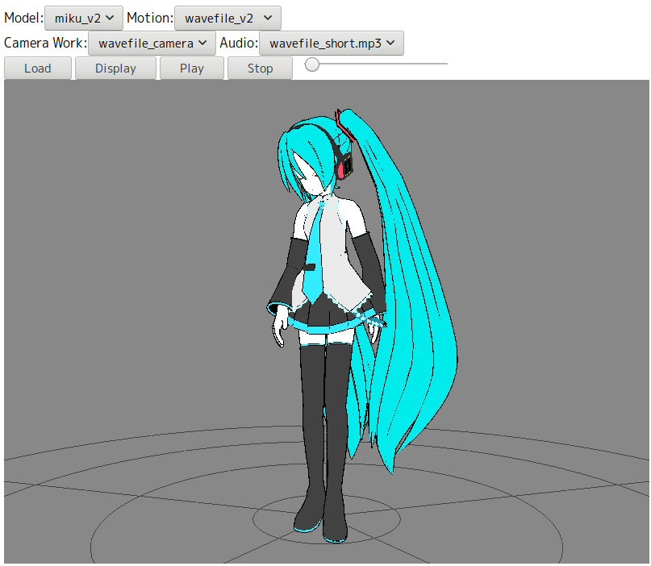

MMD-t (MikuMikuDance-t)
====

three.jsを使ったMMD再生プログラムです。  
スライダーバーで再生制御をしています。

## Description
three.jsのMMDLoader.jsから半分くらいコードを持ってきています。  
最初はMMDLoader.jsの使い方が分からず色々いじっていましたが、スライダーバーでの再生制御を入れる時点で
データのロードはMMDLoader.jsをそのまま使う様にして、helper機能はAnimationHelperとして追加して使っています。  
テストデータはthree.jsに入っているmiku_v2.pmd, wavefile_v2.vmd, wavefile_camera.vmd, wavefile_short.mp3を
使っています。動かいたい方はindex.html中にあるselect項目を適当に編集してデータを配置してください。  
(FireFox 55でしかテストしていませんので動かなかったらごめんなさい)  

## Requirement
基本的にMMDLoader.jsの依存ライブラリです。  
* three.js <https://github.com/mrdoob/three.js>
* mmd-parser <https://github.com/takahirox/mmd-parser>
* ammo.js <https://github.com/kripken/ammo.js>
* THREE.TGALoader
* THREE.MMDPhysics
* THREE.CCDIKSolver
* THREE.OutlineEffect

## Usage
index.htmlをFireFox等のブラウザで開いて下さい。(IEは動かないかも)  
Model→Motion→Camera Work→Audioの順にファイルを選択します。  
Loadボタン：読み込みボタンです。ファイルを選択している段階で読み込みを始めています。  
(読み込み終了を待つ様にしていますが個別で読み込んだ方が早いです。)  
Displayボタン：再表示します。(読み込み終了時点で表示しているのですが何故か途中の状態で表示されます。)  
Playボタン：再生ボタンです。  
Stopボタン：再生終了します。再生ボタンで再生を再開できます。  
スライダーバー：好きな所まで再生を飛ばしたり、戻したり出来ます。  
  
再生していない時にはcボタンを押すことによりカメラを移動できます。  
マウスでグリグリ出来ますｗ rで視点リセット、mでモデル側を動かせます。  

## Install
ファイルをgitから取得して展開して下さい。  
その後、以下のファイルを配置して下さい。  
(PMX, PMD両方扱えますのでデータをお持ちの方は適当に配置して下さい。)  

* model/miku/miku_v2.pmd
* motion/wavefile_motion/wavefile_v2.vmd
* motion/wavefile_motion/wavefile_camera.vmd
* audio/wavefile/wavefile_short.mp3

## Contribution
見ている人が居るか分かりませんが、何かありましたらメールしてね  
<teiji.matsusaka@gmail.com>

## Licence
MMDLoader.jsのライセンスと同じにしようと思います(three.jsのライセンスになるのかな？)  
[MIT]

## Author
[Teiji-Matsusaka](https://github.com/Teiji-Matsusaka)

